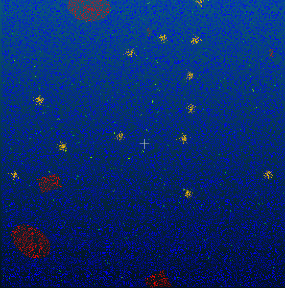
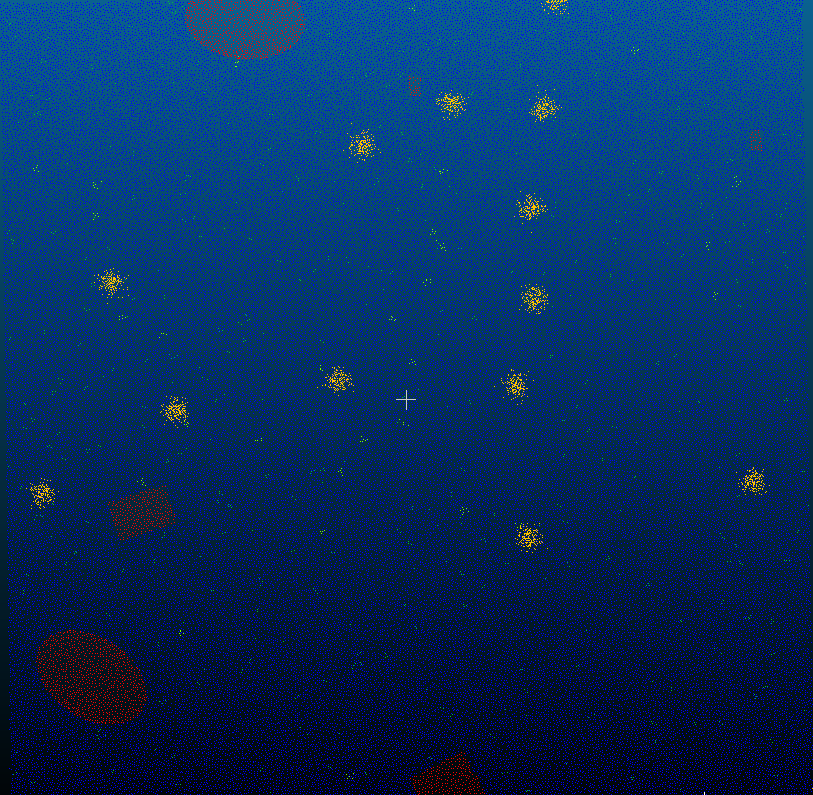
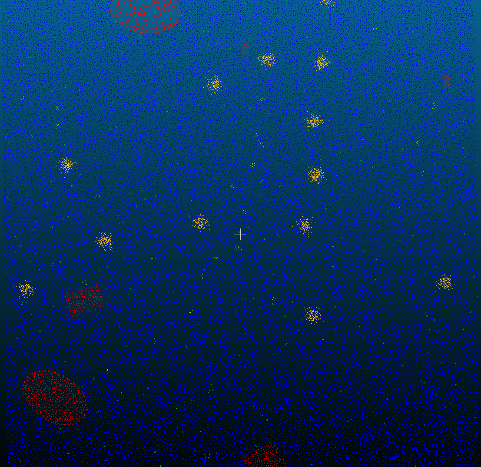

# Отчёт к заданию 1

## Subsampling в CloudCompare

### Random

  

### Spatial

  

### Octree

  

### Таблица

| Метод | Количество точек |
|-------|:----------:|
| Original | 158 953 | 
| Random | 79 209 | 
| Spatial | 80 097 |
| Octree | 77 796 |

## Ответы на вопросы

### 1. Какой метод субсэмплинга дал наилучший визуальный результат при уменьшении количества точек ~втрое?

Метод Spatial обеспечил оптимальное визуальное качество при трёхкратном сокращении точек. Он поддерживает равномерную плотность точек по всей поверхности, эффективно сохраняя геометрические контуры и детали объекта.

### 2. Как изменяется точность геометрии при различных методах субсэмплинга?

#### Random: 

Сохраняет общую форму при умеренном сокращении, но теряет важные точки на краях и переходах. При глубоком уменьшении появляются визуальные разрывы и неоднородности поверхности.

#### Spatial:

Максимально сохраняет геометрическую точность за счёт контроля минимального расстояния между точками. Поверхность остаётся целостной, нормали и кривизна искажаются минимально.

#### Octree:

Сохраняет крупные формы объекта, но мелкие детали могут теряться в зависимости от уровня разбиения. Баланс между детализацией и сокращением размера зависит от параметров октав.

### 3. Какой способ оказался самым быстрым?

Random работает быстрее всего благодаря простому алгоритму случайного отбора без сложных расчётов. Spatial требует построения пространственной решётки, Octree — создания иерархической структуры, поэтому они выполняются дольше.

### 4. Какие параметры были оптимальными для сохранения структуры объекта?

- Spatial: min space between points = 0.485 мм
- Octree: Subdivision level = 8
- Random: target point count = 79 209