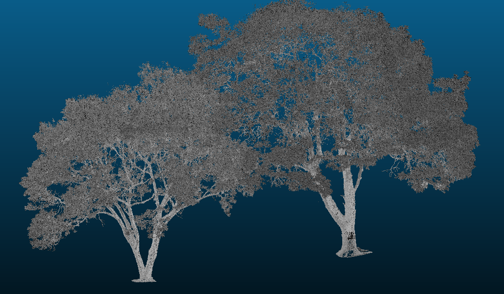
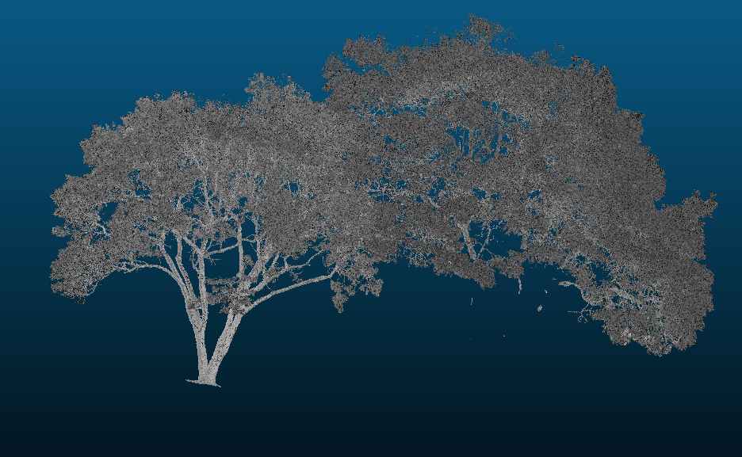
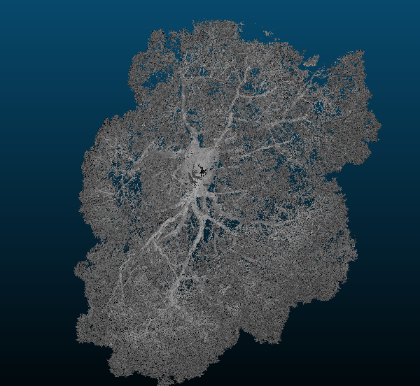
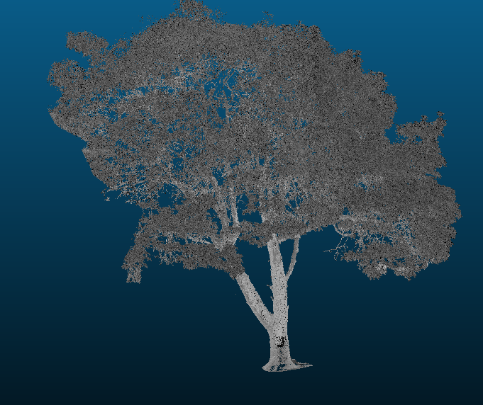
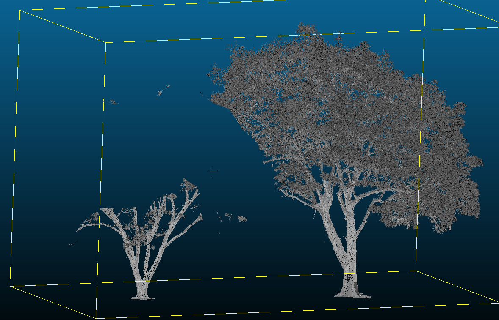

## Сегментация облака точек

### Входные данные

В работе использовано облако точек, содержащее два дерева.

---

### Скриншоты до и после сегментации

| Сцена                            | Описание                                        |                  Изображение                  |
| -------------------------------- | ----------------------------------------------- | :-------------------------------------------: |
| Исходное облако точек                 | Два дерева до обработки                         |                 |
| Левое дерево и правое без ствола                  | У правого дерева сохранена только листва                |                     |
| Вид с другого угла (одно дерево)         | Левое дерево удалено     |  |
| Левое дерево                     | Выделено отдельно                               |                         |
| Правое дерево                    | Выделено отдельно                               |                       |
| Левое (без листвы) и правое деревья                  | У левого дерева удалена листва            |                       |
---

### Краткий текстовый отчёт

**1. Используемый метод**  
Применён ручной инструмент **Segment (Polygon Selection)** в CloudCompare. Замыкание выделения — правой кнопкой мыши.

**2. Преимущества ручной сегментации**  
Инструмент эффективен при сложной топологии объектов (например, переплетённые кроны), где автоматические методы дают ошибки.

**3. Недостатки ручного подхода**  
Трудоёмкость, субъективность и низкая масштабируемость на большие наборы данных.

**4. Сохранение атрибутов**  
Все исходные атрибуты точек (цвет, интенсивность и др.) сохраняются без изменений в новых сегментах.

**5. Практическое применение**  

- Архитектурный анализ отдельных конструкций  
- Лесоуправление и экомониторинг  
- Археология — выделение артефактов на фоне местности  
- Подготовка данных для DTM/DSM

---

## Вывод

Ручная сегментация в CloudCompare обеспечивает высокую точность при выделении сложных объектов, таких как деревья с перекрывающимися кронами. Метод оказался надёжным для изолированного анализа каждого дерева.